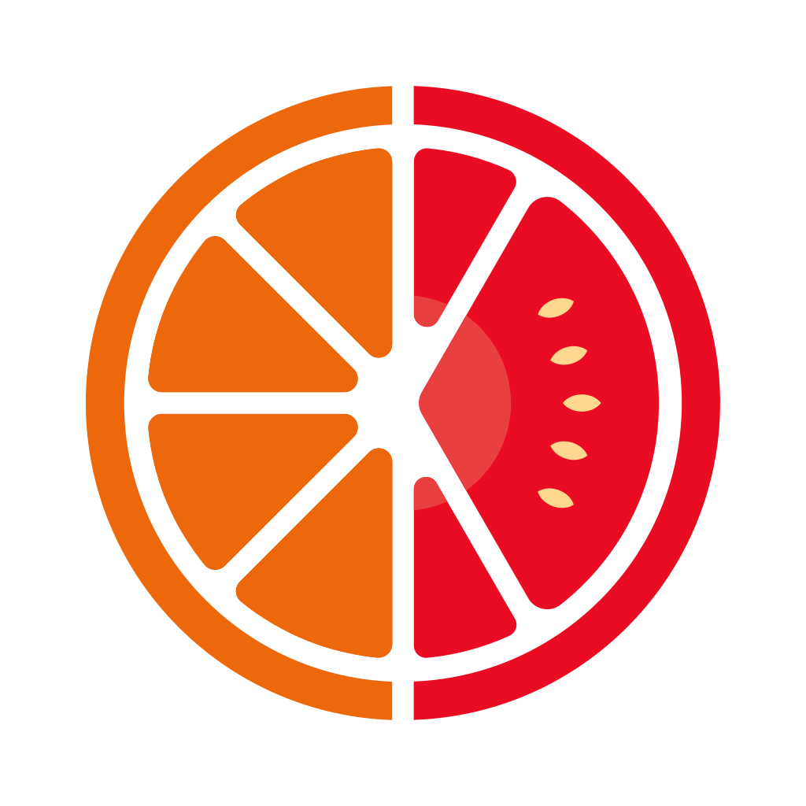

# SiFresh Cloud Computing Team Workspace

    

Here is the SiFresh CC Team Workspace

This folder contains 2 different folders, each corresponding to
their uses according to the name assigned to them.

## List of Folders

- `backend`: This folder contains the backend API source code of the SiFresh App.
- `docs`: This folder contains the Documentation website source code of the SiFresh Backend API.

## Licenses

All folders are subject to MIT License under the copyright of the CC team.
